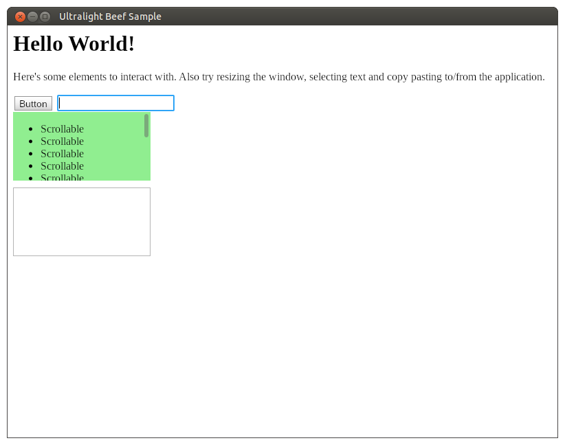

# Samples for Ultralight-beef

* GLFW sample: Rendering to an OpenGL texture and integrating as part of an OpenGL application with keyboard and mouse events and clipboard support
* PNG sample: Rendering to a PNG file. Ported from official sample 1 code.

To run the samples, clone the repository including submodules (e.g. `git clone --recurse-submodules https://github.com/kumikumi/Ultralight-beef-samples.git`). Then obtain Ultralight SDK from https://ultralig.ht/ and extract its contents into `libs/Ultralight-beef/dist/sdk`. Compile and run the code using Beef IDE or (on linux) compile it with `BeefBuild` and `cd` to project root directory and run the executable with `build/Debug_Linux64/Ultralight-beef-samples/Ultralight-beef-samples`.

## Screenshot

